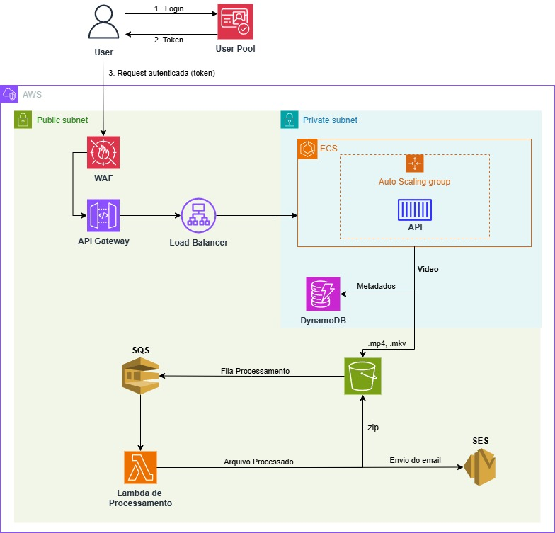

# Fiap - Software Architecture - API do projeto de processamento de video

# 1. Problema
Vocês foram contratados pela empresa FIAP X que precisa avançar no desenvolvimento de um
projeto de processamento de imagens. Em uma rodada de investimentos, a empresa apresentou um
projeto simples que processa um vídeo e retorna as imagens dele em um arquivo .zip.
Os investidores gostaram tanto do projeto, que querem investir em uma versão onde eles possam
enviar um vídeo e fazer download deste zip.

O seu desafio será desenvolver uma aplicação utilizando os conceitos apresentados no curso como:
desenho de arquitetura, desenvolvimento de microsservicos, Qualidade de Software, Mensageria
…etc
E para ajudar o seu grupo nesta etapa de levantamento de requisitos, segue alguns dos pré
requisitos esperados para este projeto:

- A nova versão do sistema deve processar mais de um vídeo ao mesmo tempo;
- Em caso de picos o sistema não deve perder uma requisição;
- O Sistema deve ser protegido por usuário e senha;
- O fluxo deve ter uma listagem de status dos vídeos de um usuário;
- Em caso de erro um usuário pode ser notificado (email ou um outro meio de comunicação)
- ### Requisitos técnicos:
    - O sistema deve persistir os dados;
    - O sistema deve estar em uma arquitetura que o permita ser escalado;
    - O projeto deve ser versionado no Github;
    - O projeto deve ter testes que garantam a sua qualidade;
    - CI/CD da aplicacao
- ### Entregáveis:
    - Documentação da arquitetura proposta para o projeto;
    - Script de criação do banco de dados ou de outros recursos utilizados;
    - Link do Github do(s) projeto(s);
    - Vídeo de no máximo 10 minutos apresentando: Documentação, Arquitetura escolhida e o
projeto funcionando.

# 2. Solução

Desenvolvido de uma aplicação utilizando as seguintes tecnologias:

- Arquitetura: DDD + Clean Architecture
- Linguagem: C# (.NET)
- Banco de dados: DynamoDB
- Cloud: AWS
- Testes: BDD + SpecFlow


## 2.1 Vídeo de apresentação do projeto
## [Link para o vídeo](https://youtu.be/BmOhPfFHHNM?si=_AlrYWsA-HPdZXII)

## 2.4 Arquitetura



## 2.4 Documentações extras

Para acessar a documentação referente a infraestrutura do projeto, vá para o repositório [FIAP-ProcessaVideo-Infra](https://github.com/GRUPO28/FIAP-ProcessaVideo-Infra)

Para acessar a documentação referente a lambda do projeto, vá para o repositório [FIAP-ProcessaVideo-Lambda](https://github.com/GRUPO28/FIAP-ProcessaVideo-Lambda)

# 3. Utilização

**Links Úteis**

- [Postman](https://tech-challenge.postman.co/workspace/FIAP---PROCESSA-VIDEO~41c1e468-80be-450e-b849-373328d74dbb/collection/40057612-d177ce8f-e675-4dcd-864c-b5cd2d6d563c?action=share&creator=40057612)

## 3.1 Rodar o projeto via Docker

1. Faça o fork ou clone do projeto

2. No nível do arquivo faça o build da imagem
    ```sh
        docker build -t videoapi .
    ```
3. No nivel do arquivo rode o comando
    ```sh
    docker run -d -p 5158:5158 \
        -e ASPNETCORE_ENVIRONMENT=Production \
        -e AWS__Region="us-east-1" \
        -e AWS__AccessKeyId="SUA AWS__AccessKeyId" \
        -e AWS__SecretAccessKey="SUA SecretAccessKey" \
        -e Database__TableName="SUA TableName" \
        -e AWSS3__BucketName="SEU BucketName" \
        -e SQS__QueueUrl="SUA QueueUrl" \
        --name fiap-processavideo-api \
        videoapi
    ```
4. Acesse a documentação das APIs via Swagger: http://localhost:5158/swagger


# 4. Participantes

- [Eric Silva](https://github.com/ericdss)
- [Felipe Augusto Lopes de Carvalho Magalhães](https://github.com/ALCM-bit)
- [Higor Hotz Vasconcelo](https://github.com/highotz)
- [Paulo Avelino Junior](https://github.com/PauloAvelino)
- [Victor Gustavo Duarte](https://github.com/victorg-duarte)